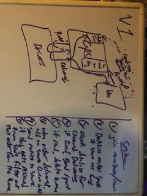
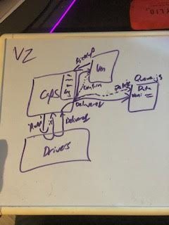

### LAB - Class 15

## Project: CAPS Phase 3 - Queue
## Auth: Julien Edwards

### Links and Resources

## 12

- [github](https://github.com/TrunkOfUkuleles/CAPS)
- [Testing](https://github.com/TrunkOfUkuleles/CAPS/actions) 

## Queue
- [github](https://github.com/TrunkOfUkuleles/CAPS-Queue)
- [Testing](https://github.com/TrunkOfUkuleles/CAPS-Queue/actions) 
### Setup

#### How to initialize/run your application (where applicable)

- 'node caps.js'
- 'node vendor.js'
- 'node driver.js'

#### Tests

ran the caps and vendor services along with the driover and noted the results. To be sure they were handling cases, I made two more vendors with different names and ran those through caps as well. 
#### UML / Application Wiring Diagram

